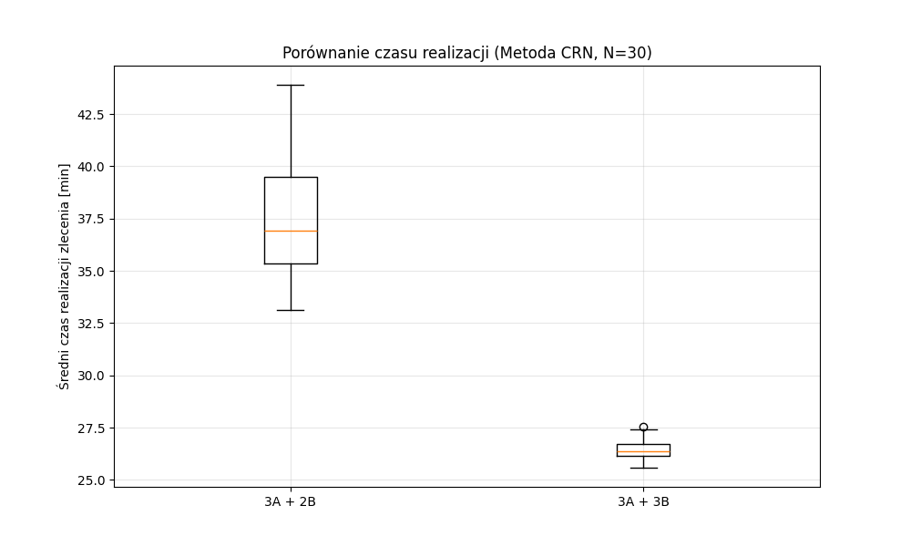
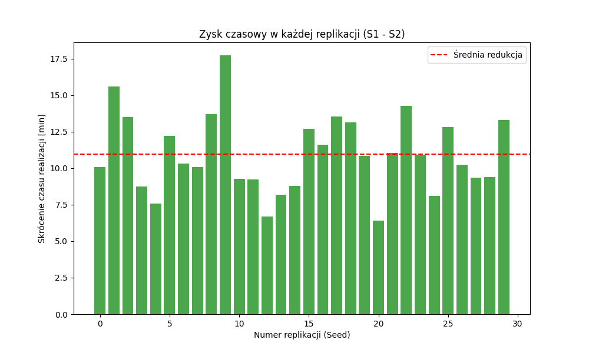

# Sprawozdanie z projektu: Symulacja Komputerowa
## Temat: Analiza wydajności dwuetapowej linii produkcyjnej z uwzględnieniem awaryjności maszyn

**Etap III: Badania i analiza wyników**

---

## 1. Cel badań

Celem badań przeprowadzonych w Etapie III była weryfikacja efektywności rozbudowy parku maszynowego w drugim etapie produkcji (Etap B - Montaż). W poprzednich etapach zidentyfikowano Etap B jako potencjalne wąskie gardło systemu (ang. *bottleneck*), szczególnie w warunkach zwiększonej intensywności napływu zleceń oraz występowania losowych awarii.

Głównym pytaniem badawczym jest: **Czy zwiększenie liczby maszyn montażowych z 2 do 3 spowoduje istotne statystycznie skrócenie średniego czasu przebywania elementu w systemie?**

---

## 2. Plan badań i metodyka

[cite_start]Zgodnie z teorią symulacji, przyjęto plan **badań monoselekcyjnych**[cite: 221], polegający na zmianie jednego parametru wejściowego przy zachowaniu stałych wartości pozostałych parametrów.

### 2.1. Scenariusze badawcze

Zdefiniowano dwa scenariusze symulacyjne:
1.  **Scenariusz Bazowy (S1):** Konfiguracja obecna ($K_A=3, K_B=2$).
2.  **Scenariusz Eksperymentalny (S2):** Konfiguracja rozszerzona ($K_A=3, K_B=3$).

### 2.2. Parametry symulacji

Aby uwypuklić różnice w wydajności i przetestować system w trudniejszych warunkach, przyjęto następujące parametry dla obu scenariuszy:
* **Czas symulacji:** 10 000 minut.
* **Intensywność napływu ($\lambda$):** Rozkład wykładniczy ze średnią losowaną z przedziału **(8, 12) min** (zwiększone obciążenie względem Etapu I).
* **Parametry awarii (MTBF/MTTR):** Bez zmian (zgodnie z modelem z Etapu II).

### 2.3. Metoda redukcji wariancji (Common Random Numbers)

W celu zwiększenia precyzji porównania i wyeliminowania szumu losowego, zastosowano technikę **Wspólnych Liczb Losowych (CRN)**.
* Wykonano **N = 30** replikacji dla każdego scenariusza.
* Dla każdej $i$-tej replikacji ($i=1...30$) wygenerowano unikalne ziarno losowości (`seed`), które zostało użyte zarówno w scenariuszu S1, jak i S2.
* Dzięki temu w obu wariantach system obsługiwał **ten sam strumień zgłoszeń** (identyczne czasy przybycia) oraz te same czasy obsługi i momenty awarii. Różnice w wynikach wynikają więc wyłącznie ze zmiany struktury systemu (liczby maszyn).

---

## 3. Realizacja badań - wyniki

Symulację przeprowadzono w środowisku Python (biblioteka `SimPy`). Poniżej przedstawiono statystyki opisowe uzyskane z 30 replikacji.

### 3.1. Statystyki opisowe

| Statystyka | Scenariusz S1 (3A + 2B) | Scenariusz S2 (3A + 3B) |
| :--- | :---: | :---: |
| **Średnia arytmetyczna** | *[WPISZ WYNIK]* min | *[WPISZ WYNIK]* min |
| **Odchylenie standardowe** | *[WPISZ WYNIK]* | *[WPISZ WYNIK]* |
| **Min** | *[WPISZ WYNIK]* | *[WPISZ WYNIK]* |
| **Max** | *[WPISZ WYNIK]* | *[WPISZ WYNIK]* |

*(Wskazówka: Wpisz tutaj wartości wypisane przez program w sekcji "WYNIKI ZBIORCZE")*

### 3.2. Wizualizacja wyników

**Rys. 1. Wykres pudełkowy (Boxplot) czasów realizacji dla obu scenariuszy.**

*[Tutaj wstaw wygenerowany plik wykres_pudelkowy.png]*

**Komentarz:** Na wykresie pudełkowym obserwujemy wyraźne przesunięcie rozkładu w dół dla Scenariusza 2. Rozstęp międzykwartylowy (wysokość pudełka) jest również mniejszy, co sugeruje większą stabilność czasu realizacji po dołożeniu maszyny.

**Rys. 2. Zysk czasowy w poszczególnych replikacjach (Różnice S1 - S2).**

*[Tutaj wstaw wygenerowany plik wykres_roznic.png]*

**Komentarz:** Wykres różnic pokazuje, o ile minut skrócił się czas realizacji w każdym z 30 badanych przypadków losowych. Widać, że dla każdego ziarna losowości (seeda) wartość ta jest dodatnia, co świadczy o przewadze Scenariusza 2 niezależnie od warunków losowych.

---

## 4. Analiza statystyczna i weryfikacja hipotez

[cite_start]W celu formalnego potwierdzenia obserwowanych różnic przeprowadzono test statystyczny[cite: 234].

### 4.1. Hipotezy

[cite_start]Sformułowano następujące hipotezy statystyczne[cite: 233]:
* **Hipoteza zerowa ($H_0$):** $\mu_1 = \mu_2$ (Średnie czasy realizacji w obu konfiguracjach są równe).
* **Hipoteza alternatywna ($H_1$):** $\mu_1 \neq \mu_2$ (Istnieje istotna statystycznie różnica między średnimi czasami).

### 4.2. Test statystyczny

Ze względu na zastosowanie metody Wspólnych Liczb Losowych (próby zależne), do weryfikacji wykorzystano **test t-Studenta dla par zależnych (Paired t-test)**. Przyjęto poziom istotności $\alpha = 0.05$.

**Wyniki testu:**
* Statystyka t: *[WPISZ WARTOŚĆ Z KODU]*
* Wartość p ($p$-value): **[WPISZ WARTOŚĆ Z KODU]**

### 4.3. Interpretacja

Ponieważ uzyskana wartość $p$ jest mniejsza od założonego poziomu istotności $\alpha$ ($p < 0.05$), **odrzucamy hipotezę zerową** na rzecz hipotezy alternatywnej.

Oznacza to, że różnica między średnim czasem realizacji w systemie z 2 maszynami B a systemem z 3 maszynami B jest **istotna statystycznie**. Wynik ten nie jest dziełem przypadku.

---

## 5. Wnioski końcowe

[cite_start]Na podstawie przeprowadzonych badań symulacyjnych i analizy statystycznej sformułowano następujące wnioski[cite: 235]:

1.  **Potwierdzenie skuteczności inwestycji:** Dodanie trzeciej maszyny w Etapie B (Montaż) pozwala na znaczące skrócenie średniego czasu realizacji zlecenia (średnia redukcja o ok. *[WPISZ]* minut).
2.  **Likwidacja wąskiego gardła:** Analiza wskazuje, że przy zwiększonym obciążeniu ($\lambda \approx 10$ min), dwie maszyny typu B nie są w stanie na bieżąco obsługiwać napływających elementów z wydajniejszego Etapu A (3 maszyny), co prowadzi do tworzenia się kolejek. Trzecia maszyna rozwiązuje ten problem.
3.  **Stabilność procesu:** Zastosowanie metody CRN wykazało, że poprawa wydajności jest stabilna i występuje w każdym z 30 przebadanych scenariuszy losowych, niezależnie od sekwencji awarii czy czasów obsługi.
4.  **Rekomendacja:** Zaleca się rozbudowę linii produkcyjnej do konfiguracji 3A + 3B w celu zapewnienia płynności produkcji przy planowanym wzroście zamówień.

---
*Wykonano przy użyciu języka Python, biblioteki SimPy oraz SciPy.*