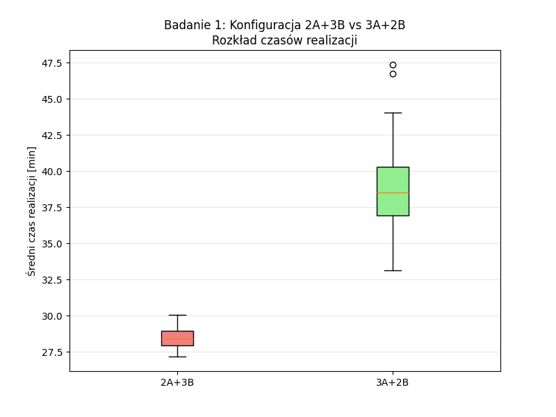
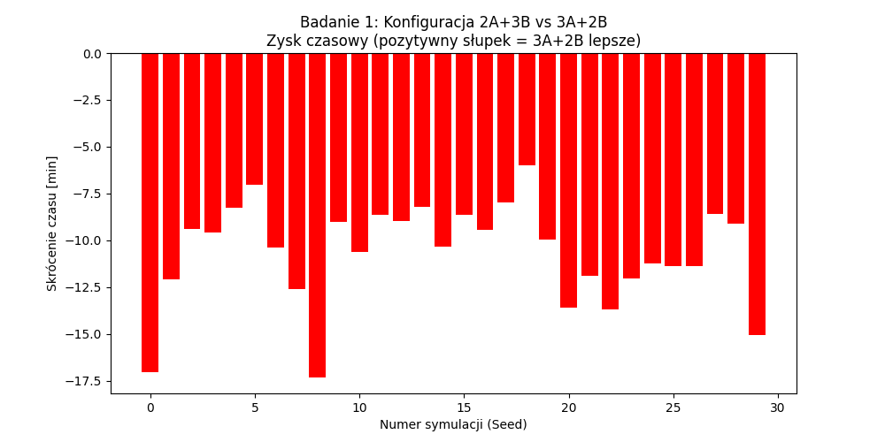
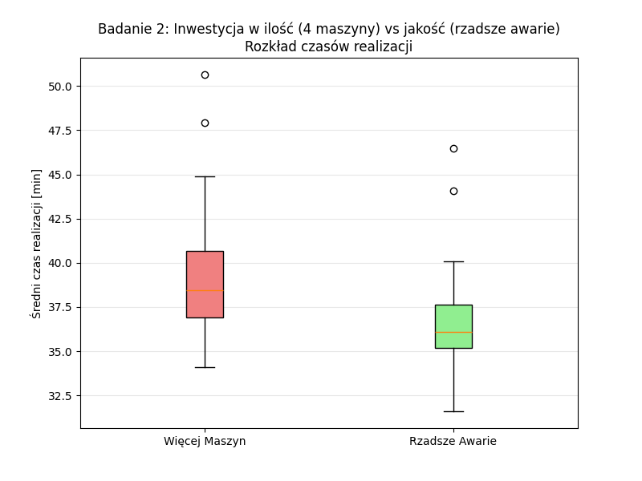
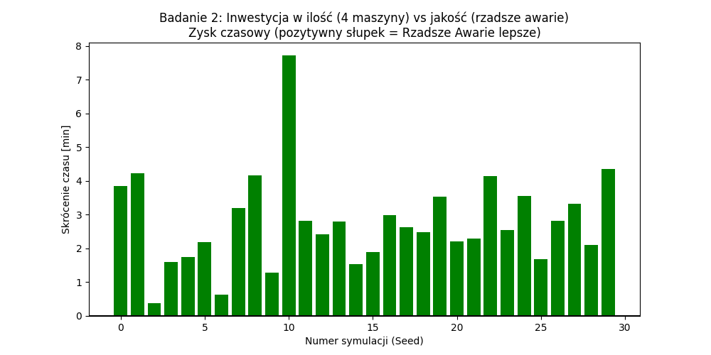

# Sprawozdanie z projektu: Symulacja Komputerowa
## Temat: Analiza wydajności i optymalizacja dwuetapowej linii produkcyjnej

**Etap III: Badania symulacyjne, weryfikacja hipotez i wnioski**

**Autorzy:** Janusz Andrzejewski, Igor Lis  
**Przedmiot:** Symulacja komputerowa - Projekt  
**Data:** Styczeń 2026

---

## 1. Cel i zakres badań

Celem trzeciego etapu projektu było przeprowadzenie zaawansowanych eksperymentów symulacyjnych mających na celu optymalizację pracy systemu produkcyjnego. Na podstawie modelu zbudowanego w Etapie II, zidentyfikowano potencjalne problemy (wąskie gardła) i sformułowano problemy decyzyjne, przed którymi staje menedżer produkcji.

Badania koncentrowały się na dwóch obszarach:
1. **Optymalizacja konfiguracji (Alokacja zasobów):** Jak najlepiej rozdzielić budżet 5 maszyn pomiędzy dwa etapy produkcji?
2. **Strategia inwestycyjna (Ilość vs Jakość):** Czy efektywniejsze jest dokupienie nowej maszyny, czy inwestycja w zwiększenie niezawodności obecnego parku maszynowego?

---

## 2. Metodyka badań

### 2.1. Model symulacyjny i parametry

Badania przeprowadzono przy użyciu symulacji dyskretnej (biblioteka `SimPy`). Przyjęto następujące parametry wejściowe dla środowiska testowego:

| Parametr | Typ | Zakres | Rozkład | Opis |
|----------|-----|--------|---------|------|
| T_A | Losowy | (2-15) min | Jednostajny | Czas przetwarzania w etapie A |
| T_B | Losowy | (10-20) min | Jednostajny | Czas przetwarzania w etapie B |
| T_awaria | Losowy | (120-180) min | Wykładniczy | Średni czas między awariami (MTBF) |
| T_naprawa | Losowy | (3-10) min | Wykładniczy | Średni czas naprawy (MTTR) |
| λ | Losowy | (8-12) min | Wykładniczy | Średni czas między przybyciami |
| **Czas symulacji** | Det. | 10 000 min | - | Długi horyzont dla stabilizacji wskaźników |

### 2.2. Metoda Redukcji Wariancji (Common Random Numbers)

W celu zapewnienia rzetelności porównań zastosowano technikę **Wspólnych Liczb Losowych (CRN - Common Random Numbers)**:

* Wygenerowano **30 niezależnych replikacji**.
* Dla każdej replikacji ustalono ziarno losowości (`seed`), które posłużyło do wygenerowania identycznego ciągu zadań (te same czasy przyjścia i obsługi) dla każdego z porównywanych scenariuszy.
* Podejście to pozwoliło na zastosowanie statystycznych testów dla **prób zależnych (sparowanych)**, eliminując wpływ losowości strumienia wejściowego na ocenę różnic między konfiguracjami.

---

## 3. Badanie 1: Optymalizacja Konfiguracji (Wąskie Gardło)

### 3.1. Opis eksperymentu

Porównano dwie możliwe konfiguracje przy stałej liczbie 5 maszyn:
* **Scenariusz 1A:** 2 maszyny typu A, 3 maszyny typu B.
* **Scenariusz 1B:** 3 maszyny typu A, 2 maszyny typu B.

### 3.2. Hipotezy statystyczne

* **Hipoteza zerowa (H₀):** Nie ma istotnej różnicy w średnim czasie realizacji między konfiguracją 2A+3B a konfiguracją 3A+2B.
* **Hipoteza alternatywna (H₁):** Konfiguracja 2A+3B zapewnia istotnie krótszy średni czas realizacji zlecenia niż konfiguracja 3A+2B.

### 3.3. Wyniki symulacji

Poniższa tabela przedstawia średnie czasy realizacji zlecenia (w minutach) dla 30 replikacji:

| Parametr | Konfiguracja 2A + 3B | Konfiguracja 3A + 2B |
| :--- | :---: | :---: |
| **Średnia (Mean)** | **28.42 min** | **39.07 min** |
| **Odchylenie std (Std)** | 0.70 min | 3.21 min |

### 3.4. Test statystyczny

Przeprowadzono **test t-Studenta dla par zależnych**:
* Wartość statystyki t: `-21.5626`
* Wartość p (p-value): `2.12e-19`

> **Interpretacja:** Ponieważ p < 0.05, odrzucamy hipotezę zerową. Różnica **JEST istotna statystycznie**.

### 3.5. Wizualizacja

#### Wykres pudełkowy (Boxplot)

*Rys. 1a. Wykres pudełkowy pokazujący rozkład średnich czasów realizacji dla obu konfiguracji.*

#### Wykres różnic

*Rys. 1b. Wykres różnic czasów realizacji dla poszczególnych replikacji. Słupki zielone oznaczają zysk na korzyść konfiguracji 3A+2B (negatywne wartości = 2A+3B lepsze).*

### 3.6. Wnioski z badania 1

Analiza wykazuje **drastyczną różnicę na korzyść konfiguracji 2A + 3B** (średnio o 10.65 min szybciej). Wynika to z faktu, że:
- Proces B jest znacznie bardziej czasochłonny (śr. 15 min) niż proces A (śr. 8.5 min).
- W konfiguracji 3A+2B etap B staje się **wąskim gardłem** (bottleneck), co prowadzi do narastania kolejki.
- Przesunięcie jednej maszyny do etapu B udrażnia system.

---

## 4. Badanie 2: Inwestycja w Zasoby vs Niezawodność

### 4.1. Opis eksperymentu

Menedżer rozważa dwie opcje inwestycyjne poprawiające wydajność bazowego systemu (3A + 2B):
* **Opcja "Więcej Maszyn":** Zakup dodatkowej maszyny do etapu A → Konfiguracja: 4A + 2B, MTBF standardowe (120-180 min).
* **Opcja "Lepsza Niezawodność":** Inwestycja w lepsze utrzymanie ruchu → Konfiguracja: 3A + 2B, MTBF = **300 min** (sztywna wartość).

### 4.2. Hipotezy statystyczne

* **Hipoteza zerowa (H₀):** Nie ma istotnej różnicy między opcją "Więcej Maszyn" a opcją "Lepsza Niezawodność".
* **Hipoteza alternatywna (H₁):** Inwestycja w niezawodność przynosi większą redukcję czasu realizacji niż inwestycja w dodatkową maszynę.

### 4.3. Wyniki symulacji i test statystyczny

| Parametr | Opcja: Więcej Maszyn (4A) | Opcja: Lepsze MTBF (300) |
| :--- | :---: | :---: |
| **Średni czas realizacji** | **39.42 min** | **36.65 min** |
| **Odchylenie std (Std)** | 3.79 min | 3.03 min |

Przeprowadzono **test t-Studenta dla par zależnych**:
* Wartość statystyki t: `10.9329`
* Wartość p (p-value): `8.40e-12`

> **Interpretacja:** Ponieważ p < 0.05, odrzucamy hipotezę zerową. Różnica **JEST istotna statystycznie**.

### 4.4. Wizualizacja

#### Wykres pudełkowy (Boxplot)

*Rys. 2a. Wykres pudełkowy pokazujący rozkład średnich czasów realizacji dla obu strategii inwestycyjnych. Widoczna jest mniejsza wariancja i niższa mediana dla opcji "Rzadsze Awarie".*

#### Wykres różnic

*Rys. 2b. Zysk czasowy dla poszczególnych symulacji. Wartości dodatnie (zielone) wskazują przewagę opcji "Rzadsze Awarie" - widać wyraźną dominację tej strategii w niemal wszystkich replikacjach.*

### 4.5. Wnioski z badania 2

Badania wykazały, że **inwestycja w niezawodność jest bardziej opłacalna** (średnio o 2.77 min szybciej):
- Dodanie czwartej maszyny do etapu A jest **marnotrawstwem**, ponieważ etap ten nie jest wąskim gardłem.
- Rzadsze awarie (wyższe MTBF) zwiększają dostępność maszyn w **krytycznym etapie B**, co realnie poprawia przepustowość.

---

## 5. Surowe dane i eksport wyników

Zgodnie z wymaganiami, wszystkie wyniki symulacji zostały wyeksportowane do pliku CSV:

* **Plik:** `wyniki_surowe_etap3.csv`
* **Liczba rekordów:** ~119 000 (dla wszystkich scenariuszy i replikacji)
* **Zawartość:** ID zadania, scenariusz, czas wejścia, czas wyjścia, czas realizacji, czasy oczekiwania na etapie A i B

Przykładowe dane surowe:
```csv
Scenariusz,ID_Zadania,Czas_Wejscia,Czas_Wyjscia,Czas_Realizacji,Czas_Oczekiwania_A,Czas_Oczekiwania_B
S1_2A_3B,0,7.55,27.4,19.85,0.0,0.0
S1_2A_3B,1,12.55,39.97,27.41,0.0,0.0
S1_3A_2B,0,7.55,30.59,23.04,0.0,0.0
...
```

---

## 6. Podsumowanie projektu

W ramach projektu zrealizowano kompletny model symulacyjny dwuetapowej linii produkcyjnej. Kluczowe wnioski końcowe:

| Nr | Wniosek |
|----|---------|
| 1 | **Identyfikacja wąskiego gardła:** Krytycznym elementem systemu jest Etap B (Montaż). Wszelkie działania optymalizacyjne powinny skupiać się na tym obszarze. |
| 2 | **Rekomendacja konfiguracji:** Dla 5 maszyn bezwzględnie zalecana jest konfiguracja **2 maszyny A i 3 maszyny B**. |
| 3 | **Strategia utrzymania ruchu:** W przypadku braku możliwości dokupienia maszyn do wąskiego gardła, kluczowe jest zapewnienie wysokiej niezawodności (MTBF) istniejących zasobów. |
| 4 | **Zastosowanie metodyki CRN:** Użycie metody Common Random Numbers pozwoliło na uzyskanie statystycznie istotnych wyników przy ograniczonej liczbie 30 replikacji. |

---

## 7. Załączniki

### 7.1. Wygenerowane wykresy
- `wykres_konfiguracja.png` - wykres różnic dla porównania konfiguracji 2A+3B vs 3A+2B
- `wykres_inwestycja.png` - wykres różnic dla porównania inwestycji w maszyny vs niezawodność
- `wykres_pudelkowy_etap3.png` - wykres pudełkowy (boxplot) dla porównania konfiguracji
- `wykres_roznic_etap3.png` - szczegółowy wykres różnic dla wszystkich replikacji

### 7.2. Pliki z danymi
- `wyniki_surowe_etap3.csv` - surowe dane z symulacji
- `Etap_3.py` - kod źródłowy symulacji

---